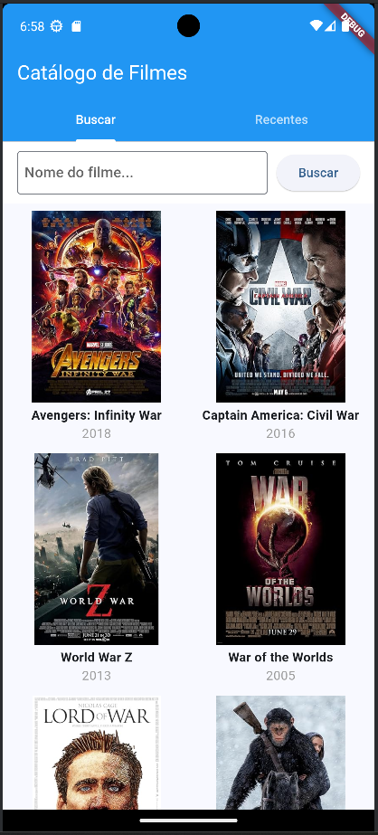
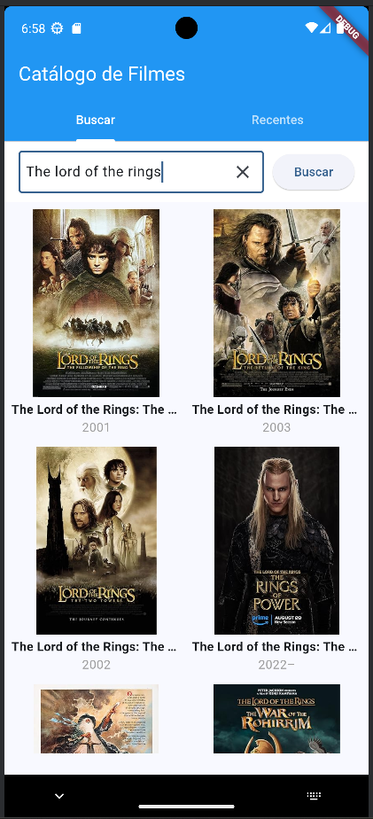
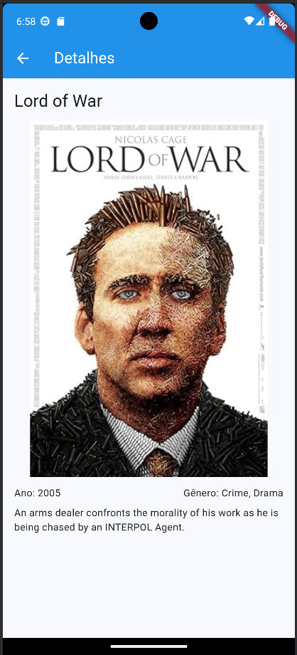
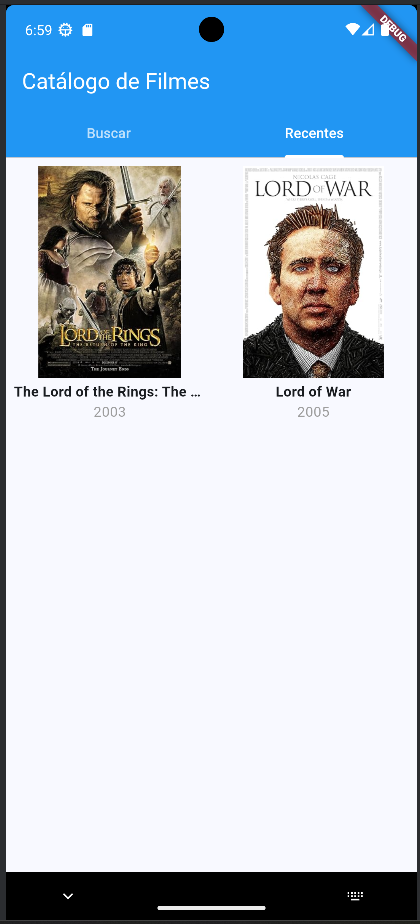

# Busca Filmes

## Como rodar o aplicativo

* Clone este repositório

```shell
git clone https://github.com/guznogueira/buscaFilmes.git
```

* Acesse a pasta do projeto

```shell
cd local-onde-clonou-projeto
```

* Instale as dependências

```shell
flutter pub get
```

* Execute o app

```shell
flutter run
```

### Obeservações

> ⚠️ Necessário estar com o Flutter configurado.  
> Para este projeto foi utilizado `dart: ">=3.4.0 <4.0.0"` e `flutter: ">=3.22.0"`

## 📸 Imagens do aplicativo

🎥 [Clique aqui para assistir uma demonstração](https://drive.google.com/file/d/1_J6igVKTjM7mrSPASj6mG-V_g42FjaZD/view?usp=sharing)

<p align="center">
  
  
  
  
</p>